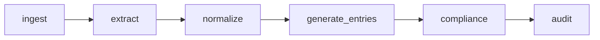
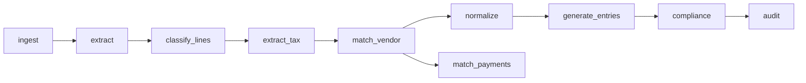
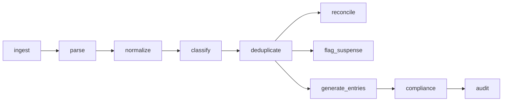
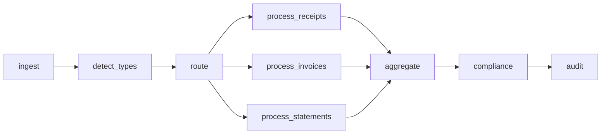

# Workflow Graph V2 — Pipeline Specifications

*Detailed workflow definitions for all document types*

---

## Receipts Workflow (Existing)



| Step | Input | Output | Duration |
|------|-------|--------|----------|
| ingest | uploaded_files | documents | <1ms |
| extract | documents | extracted_documents | <1ms |
| normalize | extracted_documents | transactions | <1ms |
| generate_entries | transactions | journal_entries | <1ms |
| compliance | transactions, journal_entries | compliance_result | <1ms |
| audit | transactions, journal_entries | audit_report | <1ms |

---

## Invoice Workflow (New)



| Step | Input | Output | Description |
|------|-------|--------|-------------|
| ingest | uploaded_files | invoice_documents | Convert files to document objects |
| extract | invoice_documents | extracted_invoices | Parse vendor, amounts, line items |
| classify_lines | extracted_invoices | classified_invoices | Assign category codes to line items |
| extract_tax | classified_invoices | tax_validated_invoices | Extract and validate tax amounts |
| match_vendor | tax_validated_invoices | vendor_matched_invoices | Match to known vendors |
| normalize | vendor_matched_invoices | invoice_transactions | Convert to transaction format |
| generate_entries | invoice_transactions | journal_entries | Create AP journal entries |
| match_payments | vendor_matched_invoices | payment_matches | Propose invoice-payment matches |
| compliance | transactions, entries | compliance_result | Run compliance checks |
| audit | transactions, entries | audit_report | Run audit checks |

### Journal Entry Format (AP Invoice)

```
DR  6100  Office Supplies      $80.00
DR  1300  Sales Tax Receivable  $6.40
    CR  2100  Accounts Payable       $86.40
```

---

## Bank Statement Workflow (New)



| Step | Input | Output | Description |
|------|-------|--------|-------------|
| ingest | uploaded_files | statement_documents | Convert files to document objects |
| parse | statement_documents | parsed_statements | Parse CSV/PDF to structured data |
| normalize | parsed_statements | normalized_statements | Standardize transaction formats |
| classify | normalized_statements | classified_statements | Assign category codes |
| deduplicate | classified_statements | deduplicated_statements | Detect duplicate transactions |
| reconcile | deduplicated_statements | reconciliation_reports | Generate match proposals |
| flag_suspense | deduplicated_statements | suspense_flags | Flag uncategorized transactions |
| generate_entries | deduplicated_statements | journal_entries | Create bank journal entries |
| compliance | transactions, entries | compliance_result | Run compliance checks |
| audit | transactions, entries | audit_report | Run audit checks |

### Reconciliation Report Format

```json
{
  "statement_id": "stmt-1",
  "total_transactions": 6,
  "matched_count": 0,
  "suggested_count": 5,
  "unmatched_count": 1,
  "is_balanced": true,
  "balance_difference": "0.00"
}
```

---

## Multi-Document Workflow (New)



| Step | Input | Output | Description |
|------|-------|--------|-------------|
| ingest | uploaded_files | raw_documents | Convert files to document objects |
| detect_types | raw_documents | classified_documents | Identify document type |
| route | classified_documents | routed_documents | Group by type |
| process_* | routed_documents | *_results | Run type-specific pipeline |
| aggregate | all results | aggregated_results | Combine all outputs |
| compliance | aggregated | compliance_result | Unified compliance check |
| audit | aggregated | audit_report | Unified audit check |

### Type Detection Keywords

| Type | Keywords |
|------|----------|
| Receipt | receipt, rcpt, pos, sale, store, coffee, uber |
| Invoice | invoice, inv, bill, due_date, net_30, vendor |
| Bank Statement | statement, bank, account, balance, csv, checking |

---

## Workflow Execution Model

### Topological Sorting

Steps execute in dependency order using Kahn's algorithm:
1. Find steps with no incoming edges
2. Execute in parallel (if possible)
3. Remove executed steps
4. Repeat until all steps complete

### Error Handling

```python
try:
    step_fn(context)
    result.status = "success"
except Exception as e:
    result.status = "failed"
    result.error = str(e)
    # Continue to next steps (partial failure)
```

### Result Collection

```python
@dataclass
class WorkflowRunResult:
    workflow_name: str
    status: str  # "success" | "partial" | "failed"
    started_at: datetime
    finished_at: datetime
    steps: List[WorkflowStepResult]
    artifacts: Dict[str, Any]
    duration_ms: float
```

---

## API Endpoints

| Endpoint | Workflow |
|----------|----------|
| `POST /agentic/demo/receipts-run/` | Receipts |
| `POST /agentic/demo/invoices-run/` | Invoices (planned) |
| `POST /agentic/demo/statements-run/` | Bank Statements (planned) |
| `POST /agentic/demo/multi-run/` | Multi-Document (planned) |

---

*December 2024*
