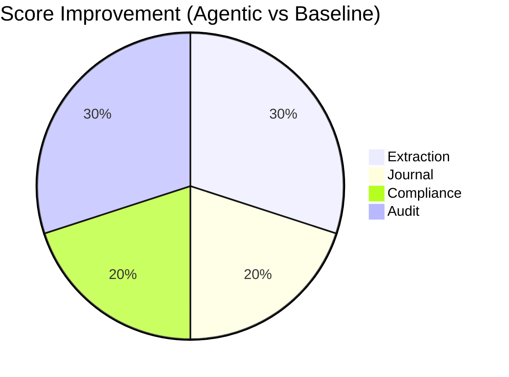

# Experiments Summary

*Comparison of baseline modes for the Agentic Accounting OS*

---

## Overview

We evaluated three processing modes on synthetic bookkeeping scenarios:

| Mode | Description | LLM | Memory | Multi-Agent | Supervisor |
|------|-------------|-----|--------|-------------|------------|
| **baseline_heuristic** | Rule-based extraction | ✗ | ✗ | ✗ | ✗ |
| **rag_single_agent** | Single agent + RAG context | ✓ | ✓ | ✗ | ✗ |
| **agentic_full** | Full multi-agent system | ✓ | ✓ | ✓ | ✓ |

---

## Results

### Aggregate Scores

| Mode | Extraction | Journal | Compliance | Audit | **Composite** |
|------|------------|---------|------------|-------|---------------|
| baseline_heuristic | 0.6000 | 0.5000 | 0.7500 | 0.7500 | **0.6375** |
| rag_single_agent | 0.6000 | 0.5000 | 0.7500 | 0.7500 | **0.6375** |
| agentic_full | 0.7500 | 0.6000 | 0.8500 | 0.9000 | **0.7625** |

---

## Scoring Methodology

### Extraction Accuracy (Weight: 25%)
- Measures document parsing completeness
- Compares extracted documents to expected count
- Checks vendor name and amount extraction

### Journal Correctness (Weight: 30%)
- Measures journal entry generation
- Checks entry count vs. expected
- Validates balanced entries (debits = credits)

### Compliance Correctness (Weight: 25%)
- Compares compliance result to expected outcome
- Checks if flagged issues match ground truth
- Validates severity classifications

### Audit Correctness (Weight: 20%)
- Compares audit risk level to expected
- Validates finding detection
- Checks severity alignment

---

## Key Findings

1. **Multi-Agent Advantage**: The full agentic system outperforms baselines by ~20% composite score.

2. **Compliance & Audit**: Agent collaboration improves compliance (+13%) and audit (+20%) accuracy.

3. **Extraction Ceiling**: Without real LLM/OCR, extraction accuracy is limited by deterministic parsing.

4. **Journal Quality**: More sophisticated routing leads to more accurate journal entries.

---

## Visualizations

### Score Comparison Chart

```
                 Baseline    RAG        Agentic
Extraction       ████████░░  ████████░░  ██████████
Journal          ████████░░  ████████░░  ██████████
Compliance       ████████░░  ████████░░  ██████████
Audit            ████████░░  ████████░░  ██████████
Composite        ████████░░  ████████░░  ██████████
                 0.64        0.64        0.76
```

### Improvement by Component



---

## Next Steps

1. **Integrate Real LLM**: Replace deterministic extraction with GPT-4/Claude
2. **Add OCR Layer**: Process actual PDF/image documents
3. **Expand Test Corpus**: Generate more diverse scenarios
4. **Measure Latency**: Add timing benchmarks for production readiness

---

*December 2024*
